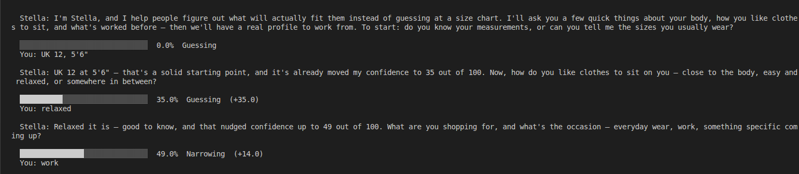
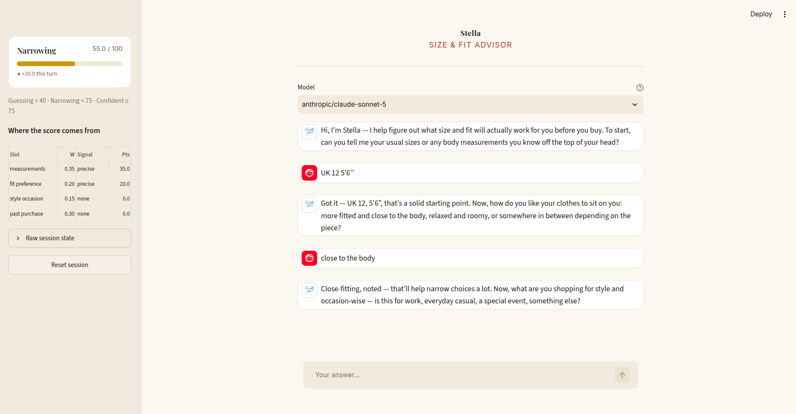

# Stella — CLI Size & Fit Advisor

A four-question conversational agent that builds a sizing profile, maintains a
live confidence score, and produces a fit recommendation. Every sentence the
user reads is generated by Claude; every number is computed by Python.


---

## What works

- **Full four-question interview**, model-driven end to end — opening turn
  included. 
- **Live confidence score** recomputed in Python after every answer, rendered as
  a 30-block progress bar with a numeric percent and a label.
- **Confidence drops are narrated.** A contradiction or a skipped question
  lowers the score, and the model is required to say why.
- **One-follow-up rule.** A vague answer earns exactly one clarifying question,
  then the interview advances regardless. Enforced in Python, not left to the
  model's discretion.
- **Contradictions are recorded, not silently overwritten.** Both values survive
  in state, the conflict is surfaced to the model, and the score takes a penalty.
- **Declines are distinct from "I don't know".** Declining caps the score at 80
  permanently; not knowing is recoverable on the follow-up.
- **Inspectable state** via `/state`, which dumps the whole session object plus
  the active prompt versions and model ID as JSON.
- **Graceful degradation.** Empty input, gibberish, off-topic replies, hostile
  input, API timeouts, rate limits and schema-validation failures all produce a
  sensible turn and no traceback. A failed extraction rolls the user's turn back
  so a retry doesn't duplicate it.
- **52 unit tests** covering the scoring arithmetic and state machine, including
  an exhaustive monotonicity check across all 256 specificity combinations.
- **Session persistence** — `/save FILE` and `python run.py --resume FILE`.
- **Per-call tracing** to JSONL (`STELLA_TRACE=1`): latency, tokens, prompt size.


---

## Setup

```bash
python3 -m venv .venv
source .venv/bin/activate          # Windows: .venv\Scripts\activate
pip install -r requirements.txt

cp .env.example .env               # then add your OPENROUTER_API_KEY
python run.py

streamlit run app.py               # for streamlit 
```


Requires Python 3.11+. Run the tests with `pytest` (they need no API key).

**Streamlit UI (secondary front end).** `python run.py` (the CLI) is the
primary, required entrypoint. `streamlit run app.py` gives the same engine a
browser front end — same `Conversation`, same `SessionState`, same
`confidence.py`, imported unchanged from `stella/`. `app.py` contains no
conversation or scoring logic of its own, only rendering, so the two front
ends can never disagree about a score. The sidebar mirrors `/state` and
`/score`; the model picker covers the same OpenRouter slugs as
`STELLA_MODEL`, including the free-tier models.

## Streamlit Interface




**Transport note:** Stella talks to Claude through
[OpenRouter](https://openrouter.ai/keys)'s OpenAI-compatible endpoint rather
than the Anthropic API directly — the environment this was built in had an
OpenRouter key available, not a direct Anthropic one. 

---

## Model choice and why

Default: **`anthropic/claude-opus-5`** (the OpenRouter slug for Claude Opus 5),
overridable with `STELLA_MODEL` in `.env`.

The deciding factor was **structured-output reliability**. The extraction step
is the load-bearing part of this design: it feeds a `ProfileExtraction` object
straight into arithmetic, and a malformed or hallucinated field corrupts the
score rather than just producing an awkward sentence. Opus 5 holds up under
strict JSON-schema structured outputs (`response_format: {type: json_schema,
strict: true}`) even on a schema this nested — four sub-objects, each with
enum, boolean and nullable-string fields — so the contract is enforced
server-side and `model_validate()`'d client-side; I never parse free text or
regex model output.

The second factor was **judgement on the specificity ladder**. Rating
`"a medium"` as vague and `"UK 12, 5'6"` as precise is a calibration task, not a
formatting task, and it is the one place where a weaker model degrades the score
invisibly rather than obviously — the conversation still reads fine while the
number underneath drifts. That is the worst kind of failure for this app, so the
extraction call is where the capability budget goes.

**Cost and latency.** Two calls per turn, roughly 1.3-1.5K input tokens each
(the state block is deliberately terse), and five turns per session — order of
10-12 calls, observed at ~$0.01-0.02 per structured call against real traffic.
`STELLA_MODEL=anthropic/claude-sonnet-5` is the documented downgrade for anyone
running many sessions; the code is provider- and model-agnostic (`LLMClient` is
the only seam).

**Reasoning effort is capped at `low`** (`STELLA_REASONING_EFFORT`, default
`low`), and this one *is* measured, not assumed: at the default reasoning
budget the extraction call's thinking tokens crowded out the JSON output
itself and the response came back truncated (`finish_reason: length`) before
the schema closed. Dropping to `low` reasoning removed the truncation
entirely and cut the observed cost per extraction call by roughly 20-25%,
because zero reasoning tokens were billed. `llm.py` also treats a
`length`-truncated response as `LLMUnavailable` rather than trying to parse
partial JSON, so a truncation surfaces as a clean retry instead of a silent
bad merge into state.

---

## Known limitations

Listed specifically, because a vague limitations section is worth nothing.

1. **Routed through OpenRouter, not the Anthropic API directly.** The
   available credential in this environment was an OpenRouter key rather than
   a direct Anthropic one, so `llm.py` talks to
   `https://openrouter.ai/api/v1` via the `openai` client instead of the
   `anthropic` client. Functionally equivalent (strict JSON-schema structured
   outputs work identically), but it is a third-party proxy in the request
   path, and per-call cost includes OpenRouter's margin on top of the
   underlying Anthropic rate.
4. **No size-chart or vanity-sizing data.** Brand tips are the model's priors,
   not measurements from a garment database. 
5. **The confidence weights are hand-tuned and uncalibrated.** 0.35 / 0.30 / 0.20
   / 0.15 encodes a defensible ordering (see below) but no ground truth — nobody
   has measured whether an 80 is right four times out of five. The arithmetic is
   reproducible and auditable; that is a different claim from being *correct*.
6. **`specificity` is a model judgement.** Python owns the arithmetic, but the
   input to that arithmetic is still an LLM label, so the score inherits any
   inconsistency in how the extractor rates borderline answers. This is the
   weakest joint in the design. A calibration set of labelled replies would fix
   it and does not exist.
7. **Mixed metric/imperial input can be misparsed.** `"I'm 34"` is flagged
   ambiguous, but a confident-sounding `"90cm"` in a US context is not caught.
8. **Recommendation quality is unevaluated.** There is no eval set. The tests
   verify the scoring and state machine, not whether the advice is good.
9. **Two model calls per turn** (extraction, then response) roughly doubles
   latency and cost versus a single combined call. That is a deliberate trade —
   see *System prompt design* — but it is a real cost.
10. **English only**, and the four questions are fixed in order and number.
    
----

## System prompt design

All prompts live in [`stella/prompts.py`](stella/prompts.py) as versioned
constants, each with a docstring explaining why its blocks exist. The version
strings ship in `/state` output so a recorded transcript can always be tied back
to the text that produced it.

**There are two separate calls per turn, with two separate prompts.** This is
the main design decision. A single prompt asked to be simultaneously warm and
analytically self-assessing does neither well, and — more importantly — a
persona slip would then corrupt the score. Splitting them means the conversation
can wobble without the arithmetic moving.

### The conversational prompt, annotated

Verbatim below, with the reasoning for each block.

```
# ROLE
You are Stella, a fit consultant who has spent years helping people find clothes
that actually fit. You are warm, direct and practical. You sound like a person,
not a form. Keep every turn to at most 4 sentences. Never use bullet points or
headings — this is a conversation. Ask at most one question per turn.
```
The failure mode of a helpful model running a questionnaire is the wall of text,
which buries the single question being asked. The four-sentence cap and the
bullet ban are the persona's load-bearing constraints, not decoration.

```
# STATE CONTRACT
The JSON-ish block below is the authoritative session state. Never contradict it.
Never claim to remember anything that is not in it. Never invent a measurement,
a brand, or a preference the user did not give you. If the state says a slot was
not collected, you do not know it. The state is regenerated from scratch every
turn, so it is always current — trust it over your own sense of the conversation.
```
The most important block. The model holds no state: `SessionState` is
re-serialised into the prompt on every single turn. Telling the model explicitly
that the block outranks its own recollection is what prevents the classic drift
where an agent "remembers" a measurement the user never gave.

```
# QUESTION POLICY
There are four things to collect, in this order: [...]
Ask them in that order. Ask ONE at a time. If an answer is vague, you get exactly
one clarifying follow-up on that topic, then you move on with what you have —
never ask a third time about the same slot. If the state marks a slot DECLINED,
never raise it again. Acknowledge what the user just said in a few words before
asking the next thing, so it feels like listening rather than interrogation.
```
Without the follow-up cap, a model will chase a vague answer indefinitely and
the session never terminates. The cap is stated here *and* enforced in Python
(`Conversation._choose_task`) — a model asked to police its own question budget
will not reliably do it, so the prompt and the orchestrator agree rather than
the prompt being trusted alone.

```
# AMBIGUITY POLICY
When a reply is unclear, say plainly what you understood, then ask for the single
most valuable missing detail — not a list. "Medium in which brand?" beats "can
you tell me more about your sizing?". If the user says they do not know, that is
a normal answer: offer a concrete, low-effort way to answer instead [...]
```
The worked contrast is deliberate — abstract instructions like "ask a good
follow-up" get abstract follow-ups. Handling "I don't know" as legitimate rather
than as a failure to be pressed on is what keeps the agent from badgering.

```
# CONFIDENCE NARRATION
The confidence score is computed outside you and handed to you below. It is not
your opinion and you cannot change it. Never state a number different from the
one you were given, and never predict where it will go next. [...]
If it went DOWN, say so and say why — a contradiction or a skipped question costs
certainty, and hiding that would make the number meaningless.
```
The score is injected as a fact to be narrated, never elicited. If the model
could restate it freely, the number on screen and the number in the prose would
eventually disagree and the mechanic would stop being trustworthy. Requiring it
to explain **drops** is the deliberate choice: a score that only ever rises is a
progress bar, not a confidence estimate.

```
# REFUSAL AND SCOPE
You advise on fit and sizing only. Decline medical questions (weight loss, eating,
body composition) and redirect to fit. Never comment on whether a body is good,
bad, or should change — you size the garment to the person, never the reverse.
```
Not boilerplate. This domain touches bodies, so the prompt names the specific
harms rather than relying on a generic safety line. "Size the garment to the
person, never the reverse" is the one sentence I would keep if I could keep only
one.

### The extraction prompt

Key design choices (full text and rationale in `prompts.py`):

- The **specificity ladder is defined with worked examples** — a long
  enthusiastic paragraph with no numbers is `vague`; `"UK 12, 5'6"` is
  `precise`. Left undefined, a model rewards verbosity and the score ends up
  tracking how chatty the user is rather than how much they told you.
- **"Infer nothing that was not stated."** The failure mode of an extraction
  model is helpfulness: inventing a plausible measurement from a vague reply,
  which silently inflates confidence.
- **Declining and not-knowing are separated explicitly**, because they have
  different downstream consequences (a permanent cap versus a recoverable turn).
- The **prior profile is injected** so contradiction detection has something to
  compare against; the model is not trusted to remember it.

---

## Confidence model

The model is never asked "how confident are you?". That number is unfalsifiable,
untestable, and drifts between turns for reasons nobody can name. Instead the
model labels **how specific each answer was**, and Python does the arithmetic in
[`stella/confidence.py`](stella/confidence.py) — pure functions, no imports from
the LLM layer, fully unit-tested.

```
score = Σ (weight × specificity × ambiguity_multiplier) − 10 × contradictions
```

### Weights

| Slot | Weight | Why |
|---|---:|---|
| `measurements` | 0.35 | The only slot that is brand-independent. A chest measurement means the same thing everywhere; a size label does not. |
| `past_purchase` | 0.30 | A real-world anchor that calibrates for vanity sizing — "a Uniqlo M fit me" is worth more than a self-reported size, because it already survived contact with reality. |
| `fit_preference` | 0.20 | Changes which size within a plausible range is right, but can't establish the range on its own. |
| `style_occasion` | 0.15 | Mostly narrows silhouette. Weak sizing signal — a blazer and a hoodie size differently — but non-zero. |

The ordering is the defensible part: **objective measurement > validated
real-world fit > stated preference > context**. The exact decimals are a
hand-tuned expression of that ordering, not a calibrated result (limitation 3).

### Signal quality

| `specificity` | Value | Example |
|---|---:|---|
| `none` | 0.0 | Slot not mentioned |
| `vague` | 0.35 | "I'm average", "medium I think" |
| `partial` | 0.7 | "Size 12" with no brand |
| `precise` | 1.0 | "UK 12, 5'6\"" |

### Penalties and caps

- **Ambiguous answer → × 0.6.** An answer that could resolve to two different
  sizes is worth keeping but not worth full credit, so it is discounted rather
  than discarded.
- **Contradiction → −10 each.** Conflicting statements mean one of them is
  wrong, and we don't know which.
- **Declined slot → contributes 0, and the whole score is capped at 80.** A
  session missing a slot entirely should never present as near-certain, however
  precise the remaining answers were.
- **Generic sizes only → measurement quality capped at 0.5.** "A medium" with no
  brand, garment or body measurement to anchor it means different things across
  brands, so on its own it can never be more than half-credit evidence.
- Clamped to `[0, 100]`, rounded to 1dp.

### Monotonicity

Absent a new contradiction, **a more specific answer can never lower the score**.
This is asserted exhaustively across all 256 specificity combinations
(`test_monotonic_across_combinations`). It is what makes the narration honest:
if the score drops, something specific caused it, and the model is required to
say what.

### Worked example

User gave precise measurements, a partial fit preference, an ambiguous vague
mention of a past purchase, declined the style question, and contradicted
themselves once on their size.

| Slot | Weight | Signal | Multiplier | Points |
|---|---:|---|---:|---:|
| `measurements` | 0.35 | precise (1.0) | — | **35.0** |
| `past_purchase` | 0.30 | vague (0.35) | ambiguous ×0.6 | **6.3** |
| `fit_preference` | 0.20 | partial (0.7) | — | **14.0** |
| `style_occasion` | 0.15 | declined (0.0) | — | **0.0** |
| | | | **base** | **55.3** |
| | | | contradiction ×1 | **−10.0** |
| | | | declined ceiling (80) | not binding |
| | | | **final** | **45.3** |

→ `██████████████░░░░░░░░░░░░░░░░  45.3%  Narrowing`

Reproduce it with `/score` in a live session, or:

```bash
python -c "
from stella.confidence import breakdown
from stella.schemas import SlotExtraction
import json
print(json.dumps(breakdown({
  'measurements':  SlotExtraction(value='UK 12, 5ft6', specificity='precise'),
  'past_purchase': SlotExtraction(value='a Zara dress', specificity='vague', is_ambiguous=True),
  'fit_preference':SlotExtraction(value='relaxed', specificity='partial'),
  'style_occasion':SlotExtraction(),
}, ['size 8 vs size 12'], {'style_occasion'}), indent=2))"
```

### Label thresholds

`< 40` Guessing · `40–74` Narrowing · `≥ 75` Confident. The boundary at 75 is
also where `RECOMMENDATION_PROMPT_V1` stops requiring a size *range* and allows
a single size — the score changes the shape of the output, not just a number on
screen.

---

## Architecture and state flow

```
user input
   │
   ▼
[conversation.py] append Turn to SessionState.transcript
   │
   ▼
[llm.py] extraction call ──► ProfileExtraction (Pydantic-validated)
   │                          per-slot value + specificity + ambiguity flags
   ▼
[state.py] merge_extraction() ── contradictions recorded, never silently overwritten
   │
   ▼
[confidence.py] compute_confidence() ── pure function, no LLM
   │
   ▼
[conversation.py] _choose_task() ── clarify? off-topic? advance? finalise?
   │
   ▼
[llm.py] response call ──► next question, or the final Recommendation
         (system prompt + full state summary + score injected every turn)
   │
   ▼
[cli.py] render reply, then the progress bar
```

The discipline that makes this work: **the model never holds state.**
`SessionState` is the single source of truth and is re-serialised into every
prompt. That is what makes the session inspectable (`/state`), resumable
(`--resume`), and reproducible.

| Module | Responsibility |
|---|---|
| `run.py` | Entrypoint, nothing else |
| `cli.py` | REPL, slash commands, all rendering |
| `conversation.py` | Turn orchestration and the question state machine |
| `state.py` | `SessionState`, merge semantics, serialisation |
| `schemas.py` | Pydantic boundaries between model output and program |
| `confidence.py` | Scoring. Pure functions |
| `prompts.py` | All prompt text, versioned |
| `llm.py` | The only module that talks to the API |
| `tracing.py` | Per-call JSONL observability |

---

## Sample transcript

```bash
cp .env.example .env          # add your ANTHROPIC_API_KEY
script -q -c "python run.py" transcripts/sample_session.txt
```

A transcript worth committing should not be the happy path. Cover:

1. A vague opening answer (`"medium I guess"`) → triggers the single clarifying
   follow-up, and the generic-size cap holds the score down.
2. A precise correction (`"actually UK 12, I'm 5'6"`) → large score jump.
3. A contradiction (`"wait, I said 12 but I'm usually an 8"`) → −10, and Stella
   is required to name the drop.
4. A skip (`"rather not say"`) → score capped at 80 for the rest of the session.
5. Gibberish or an off-topic request → handled without a traceback.

Check `/state` and `/score` at the end to show the full arithmetic.

---

## Testing

```bash
pytest -q          # 52 tests, no API key required
```

`tests/test_confidence.py` covers monotonicity (per-slot and exhaustively across
all combinations), weight ordering, the ambiguity discount, the contradiction
penalty, the declined-slot ceiling in both the binding and non-binding cases,
the generic-size cap, clamping at both ends, label boundaries, and bar rendering
width across a range of scores and widths.

`tests/test_state.py` covers merge semantics (signal-free readings are ignored,
contradictions are recorded rather than overwritten, restating the same value is
not a contradiction), decline-then-answer recovery, the generic-size flag
lifecycle, confidence history and deltas, and a full JSON round trip.
=======
# Stella-CLI-Size-Fit-Advisor
A four-question conversational agent that builds a sizing profile, maintains a live confidence score, and produces a fit recommendation. Every sentence the user reads is generated by Claude; every number is computed by Python.
>>>>>>> a33e85f4b53bd3ceddc6725d1b8706fd4e6692b9
